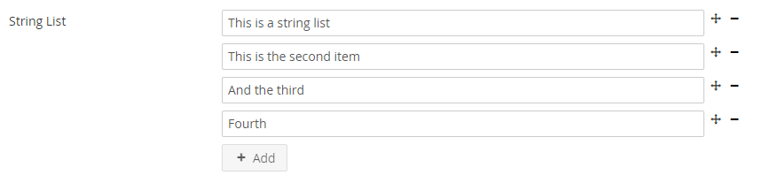
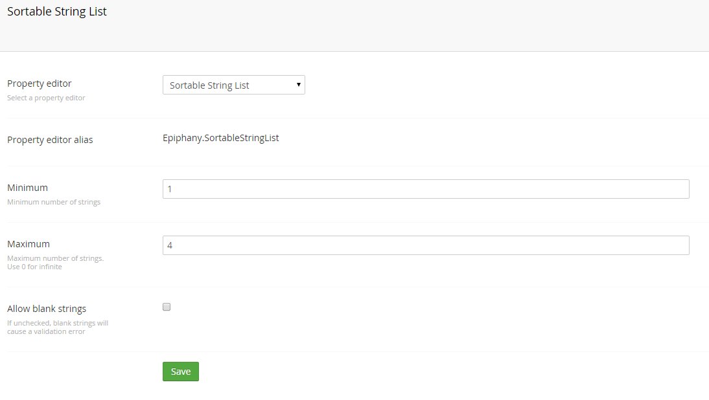

# Sortable String List

A property editor for Umbraco 7.x to provide a sortable list of strings. 

## Screenshots
### In action

### Configuration

## Installation

1. Clone the repository to `/App_Plugins/SortableStringList`
2. A property value converter is available in [this gist](https://gist.github.com/ryanlewis/9eb27975d690b5f12e6c). This can be saved in your `/App_Code` directory